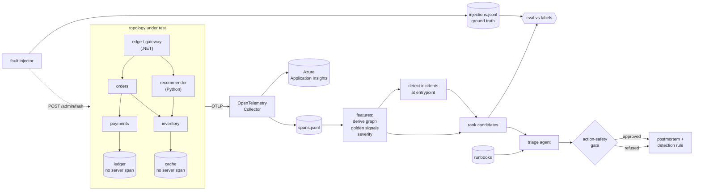

# Brainstem — root-cause localization for distributed traces

[](https://github.com/aaditya0602/azure-aiops-rca/actions/workflows/verify.yml)

Given OpenTelemetry traces from a microservice topology and an incident, decide
**which service is the root cause** — and prove the answer against injected
ground truth instead of asserting it.

Runs on Azure Container Apps with traces flowing to Application Insights, and
locally under `docker compose` with an OpenTelemetry Collector. The analyzer never
sees the topology file: it derives the call graph from spans alone.

---

## The result, including the part that didn't work

The headline is not the graph algorithm I set out to build. It's a feature.

**What works:** localizing by *self time* plus **span-derived error attribution** —
classifying an ERROR span as the service's own failure only when it has no failed
child span. On 18 services and 83 injected fault groups this takes top-1 accuracy
from **79.2% → 100%** over the strong baseline, and on concurrent two-cause
incidents from **63.0% → 100%**.

**What didn't work:** a random walk with restart over the derived call graph — the
thing the project was originally about. It ties on single-cause incidents and is
**worse** on concurrent ones (92.6% vs 100%). It is retained in the repo as an
evaluated, rejected alternative, because "we tried it and measured it" is worth
more than quietly deleting it. Mechanism for the loss: its temporal-precedence
prior assumes a cause precedes its effects, which is sound for one cause but
actively penalizes the later of two independent causes.

Two bugs found along the way are documented in [Findings](#findings) — one of them
moved accuracy from 27.8% to 100% and had nothing to do with the algorithm.

---

## Numbers

18-service topology, seed 1337, 2h simulated at 10 rps, **2,682,354 spans**,
83 injected fault groups, detector threshold 3.0.
Regenerate with `make synth && make eval`.

### Detection

| metric | value |
|---|---|
| fault groups detected | 75 / 83 (**90.4%** recall) |
| false-positive incidents | 6 (≈3/hour) |
| MTTD | **4.1s** mean, 24.1s p95 |

### Localization — single-cause incidents (n=48)

| method | top-1 | top-3 |
|---|---|---|
| `naive_inclusive` | 72.9% | 85.4% |
| `self_time` (APM-standard baseline) | 79.2% | 91.7% |
| **`attributed`** (shipped) | **100%** | **100%** |
| `graph` (rejected) | 100% | 100% |

By fault kind, top-1 %:

| kind | n | naive | self_time | **attributed** | graph |
|---|---|---|---|---|---|
| latency | 10 | 80.0 | 100.0 | **100.0** | 100.0 |
| cpu | 5 | 80.0 | 100.0 | **100.0** | 100.0 |
| memleak | 11 | 100.0 | 100.0 | **100.0** | 100.0 |
| `dep_fail` | 10 | 60.0 | 60.0 | **100.0** | 100.0 |
| `error` | 12 | 50.0 | 50.0 | **100.0** | 100.0 |

The whole gap lives in the last two rows, and for one reason: when a service
fast-fails or propagates a downstream error, **latency-based localization has no
signal to work with** and raw error rate cannot distinguish the culprit from
everyone relaying its failure.

### Localization — concurrent incidents, 2 independent causes (n=27)

| method | both in top-2 | both in top-3 |
|---|---|---|
| `naive_inclusive` | 37.0% | 77.8% |
| `self_time` | 63.0% | 92.6% |
| **`attributed`** | **100%** | **100%** |
| `graph` | 92.6% | 96.3% |

### Where it breaks — severity sweep

A flat 100% means the faults were loud, not that the method is good. Fault
magnitude scaled from blatant (1.0) toward invisible (0.1); mean over seeds
1337/7/99, single-cause top-1. Regenerate with `make sweep`.

| mag scale | detect recall | naive | self_time | **attributed** | graph |
|---|---|---|---|---|---|
| 1.0 | 70.5% | 68.5 | 75.1 | **100.0** | 96.1 |
| 0.5 | 59.5% | 59.7 | 68.6 | **100.0** | 95.5 |
| 0.3 | 62.9% | 48.0 | 54.0 | **85.3** | 81.4 |
| 0.18 | 56.7% | 50.9 | 60.0 | **80.0** | 77.3 |
| 0.1 | 39.3% | 36.4 | 46.4 | **57.7** | 57.5 |

Localization degrades gracefully; **detection is the real ceiling.** At scale 0.1
only 39% of faults ever alert, so localization accuracy is moot for the other 61%.
(Sweep recall is lower than the headline because it runs 1h at 8 rps — fewer
samples per bucket — versus 2h at 10 rps.)

### The real stack — small n, stated as such

The same analyzer, unchanged, run on **142,846 real spans** from the 7-container
stack: actual .NET and Python processes, real HTTP between them, spans collected by
a real OpenTelemetry Collector, faults injected into the services themselves via
`/admin/fault`. `eval/results/real_stack.json`.

| | value |
|---|---|
| spans converted from collector output | 142,846 (61,966 server / 80,880 client) |
| client spans carrying `peer.service` | 80,880 (100%) |
| services observed / edges derived | 7 / 7 — matches `small.yaml` exactly |
| fault groups detected | 4 / 8 (50% recall) |

| method | top-1 (n=4) |
|---|---|
| `naive_inclusive` | 75.0% |
| `self_time` | 75.0% |
| `attributed` | 100% |

**n=4 is far too small to claim anything from.** It is reported because it shows
the pipeline works end to end on genuine cross-process, cross-language telemetry,
and because the one discriminating case reproduces the synthetic finding: on the
two `error` faults, `naive`/`self_time` got 50% and `attributed` got 100%.
Detection recall is also much worse than synthetic (50% vs 90%) — a 7-minute run
gives the median/MAD baseline far fewer buckets to work with. The statistical
claims in this README come from the synthetic track; this track is an
integration proof.

### Azure — verified, not just deployed

All seven services running on Container Apps, traces reaching Application Insights
through the collector's `azuremonitor` exporter. Confirmed by querying App
Insights directly:

```
cloud_RoleName    spans
recommender        3175
inventory          3171
gateway            2393
orders             2392
payments           1594
```

`ledger` and `cache` correctly appear only as dependency targets, never as roles —
they emit no server spans, which is the whole point of them.

### Detector operating curve

Threshold is an explicit tradeoff, not a magic constant. `make detection-curve`:

| threshold | recall | false positives | MTTD | attributed top-1 |
|---|---|---|---|---|
| 1.5 | 100.0% | 70 | 2.6s | 100% |
| 2.0 | 95.2% | 46 | 2.3s | 100% |
| 2.5 | 94.0% | 19 | 3.4s | 100% |
| **3.0** | **90.4%** | **6** | **4.1s** | **100%** |
| 3.5 | 84.3% | 2 | 4.7s | 100% |
| 5.0 | 73.5% | 4 | 2.8s | 100% |

3.0 is the shipped default: 90% recall at ~3 false alarms/hour.

---

## How it works



### The three ideas that matter

**1. Severity must be comparable across services.** A per-service z-score answers
"is this service unusual *for itself*" — valid for detection, invalid for ranking
two services against each other, because a rarely-affected service earns a huge z
for a small change while a frequently-affected one earns a small z for a large
change. Ranking uses log2 fold-change for latency and `-log2(1-Δ)` for error rates,
which are comparable by construction. Absolute milliseconds are not comparable
when service baselines differ 20×.

**2. Error attribution.** An ERROR span whose client child also failed was caused
downstream. An ERROR span with no failed child is the service's *own* failure.
`err_own` is that second quantity, and it is the entire reason `attributed` beats
`self_time`. Note this is a *graph-derived feature* — it needs parent/child span
structure — which is why the ablation separates it from the random walk.

**3. Faults propagate upward, so the loudest service is rarely the culprit.** A
parent's inclusive duration contains its children's, so a slow leaf makes every
ancestor slow. `naive_inclusive` exists in the harness to quantify how wrong that
obvious approach is.

### The ablation ladder

Each rung changes exactly one thing, so a win is attributable to an idea rather
than to "the pipeline":

| method | latency signal | error signal | graph walk |
|---|---|---|---|
| `naive_inclusive` | inclusive | raw rate | no |
| `self_time` | **self time** | raw rate | no |
| `attributed` | self time | **own-error** | no |
| `graph` | self time | own-error | **yes** |

Keeping `self_time` honest matters: it's how commercial APM localizes latency, and
beating only the strawman would prove nothing.

---

## Reproduce

Everything below is offline — no Docker, no Azure, no API key.

```bash
python -m venv .venv && .venv/bin/pip install -r requirements.txt -r requirements-dev.txt
```

```bash
make verify
```

`verify` runs 32 unit tests, then generates a seeded scenario and asserts both an
absolute floor (attributed top-1 ≥ 90%) **and** a margin over the baseline
(≥ 15 points). The margin check is the important one: if error attribution
silently breaks, `attributed` collapses onto `self_time` and an absolute-only gate
might still pass. Fixed seed, so both numbers are exactly reproducible — this is
the same gate CI runs on every push.

Other targets: `make synth`, `make eval`, `make sweep`, `make detection-curve`.

On Windows, call the venv interpreter directly:

```bash
.\.venv\Scripts\python.exe analyzer\eval.py --threshold 3.0
```

### The real stack

```bash
make up && make real-scenario && make real-eval
```

Seven containers, real HTTP between real processes, spans collected by a real
OpenTelemetry Collector, faults injected into the services themselves via
`/admin/fault`. `harness/otlp_to_spans.py` converts collector output into the same
JSONL the synthetic track produces, so the analyzer runs unchanged on both.

### Azure

```bash
pwsh ./scripts/deploy-azure.ps1 -SubscriptionId <your-sub-id>
```

Three phases: Bicep provisions Log Analytics / Application Insights / ACR /
Container Apps environment → both images are built and pushed to ACR → Bicep
deploys the collector and topology. Traces land in Application Insights via the
collector's `azuremonitor` exporter.

**Azure for Students cannot use server-side ACR builds.** `az acr build` returns
`TasksOperationsNotAllowed` on that subscription type — the registry works, ACR
*Tasks* is what's blocked. So images are built locally (Docker required) and
pushed. On a subscription where Tasks is permitted, `-UseAcrTasks` skips the local
build. The script verifies both images are actually in the registry before
deploying, because Container Apps will happily accept a reference to an image that
does not exist and then fail to pull.

```bash
pwsh ./scripts/destroy-azure.ps1 -SubscriptionId <your-sub-id>
```

Tear down when finished — an idle Container Apps environment still bills.

---

## Triage agent and the action-safety gate

The analyzer decides *where*; the model only explains evidence and proposes a
mitigation in the runbook's own terms. It never picks a root cause freely.

The gate applies five checks and **refuses by default**:

| check | refuses when |
|---|---|
| grounding | the named service isn't in the derived graph (hallucinated name) |
| candidacy | the named root cause isn't among the RCA candidates |
| runbook | no runbook cited for an irreversible action, or the cited one is **superseded** |
| authorization | the runbook doesn't list that verb for that target |
| preconditions | any required precondition isn't explicitly claimed as checked |

Anything failing a check is dropped and the proposal degrades to diagnosis-only,
which is always safe to show a human. 14 gate tests cover each refusal path —
including that `rb-payments-errors-v3` forbids restarting payments, because
in-flight authorizations aren't idempotent and a restart can double-charge — plus
7 orchestration tests covering evidence assembly, fenced-JSON extraction, and
graceful degradation when the model returns something unparseable.

Providers are pluggable: **z.ai GLM** (dev default), **Azure AI Foundry**, or
**cassette** replay of recorded responses so the pipeline is deterministic and CI
runs with no key and no network. Cassettes are recorded from a real provider via
`--record`; they are never hand-written. Keys are read from the environment only.

Each triage also emits a proposed **detection rule** aimed at whichever signal
actually moved, closing the loop: the generic entrypoint threshold found this
incident in 4.1s; a rule on the culprit's own signal finds the next one sooner.

---

## Findings

**Per-service z-scores are not comparable across services.** First implementation
ranked by them and scored 27.8% top-1 — *worse than the naive baseline*. Every
method failed identically on error faults (0%), which is the signature of a shared
feature bug rather than a ranking problem. In one case `orders` had the higher raw
error rate (0.489 vs the gateway's 0.390) but an anomaly score 19× lower, because
its own history was noisier. Separating detection (z-score) from ranking
(comparable severity) took the same algorithm to 100%.

**The benchmark was too easy before shared dependencies.** On a 7-node tree
everything scored ~100% and the methods were indistinguishable — an underpowered
experiment can't support a claim. Real systems aren't trees: `product-db` is called
by four services, so one fault lights up six across unrelated-looking subtrees.
The 18-node topology has shared dependencies at three levels, and that's what
separated the methods.

**Detection, not localization, is the bottleneck.** Every localization method is
capped by whether the incident alerted at all. At full severity 9.6% of faults
never alert; at scale 0.1, 61% never do.

**Two silent-telemetry-loss bugs on Container Apps.** Both had the same shape: the
application keeps serving traffic normally and nothing logs an error, while traces
go nowhere.
1. ACA ingress listens on 80/443 and forwards to `targetPort`, so the collector
   must be addressed on port 80. Pointing services at `:4317` produced a fully
   healthy-looking deployment with an empty Application Insights.
2. With the port then omitted entirely, the .NET exporter inferred 80 but the
   Python OTLP **gRPC** exporter defaulted to 4317 — so exactly one service went
   missing. Stating `:80` explicitly fixed it.

Worth noting because both were invisible from the app's own health signals; only
querying the telemetry backend revealed them.

---

## Limitations

Stated plainly, because a reviewer will find these anyway:

- **The 18-node study is synthetic.** Latency is drawn from lognormals and faults
  from a scripted injector. It buys statistical power (83 incidents, multi-seed,
  severity sweep) that a laptop-scale real stack can't. The real Docker/Azure track
  proves the OTel pipeline and analyzer work on genuine cross-process,
  cross-language telemetry — it is not run at that scale.
- **The real-stack run is n=4.** Enough to demonstrate the pipeline end to end,
  nowhere near enough to support an accuracy claim. Every number worth quoting
  comes from the synthetic track.
- **Datastore nodes are stand-ins.** `ledger` and `cache` run the same service
  image with server spans suppressed to imitate uninstrumented Postgres/Redis.
  They are not real datastores, and no real query or eviction behaviour is modeled.
- **At most two concurrent causes.** Three or more, and cascading failures where
  one fault causes another, are not modeled.
- **The detector is a robust z-score on golden signals**, not SLO burn-rate
  alerting. Multi-window burn rate is what a real SRE org would use.
- **Container Apps, not AKS.** Chosen for a 3-minute deploy and scale-to-zero
  cost. AKS with KEDA is the honest next step.
- **ACR admin credentials** are used to keep the deploy one command. A managed
  identity with `AcrPull` is the correct production answer.
- **No agent accuracy claim.** The gate's refusal logic is tested; the quality of
  the model's *reasoning* is not measured, and I'd want an LLM-judge eval with
  human-labelled incidents before claiming anything there.

## Layout

```
analyzer/     features (graph derivation, severity), rca (4 rankers), eval, sweeps
harness/      synth (synthetic traces + ground truth), loadgen, injector, otlp converter
services/     node (.NET generic service), recommender (Python)
agent/         providers, runbooks loader, action-safety gate, triage
runbooks/     markdown + YAML frontmatter the gate machine-checks
infra/        main.bicep — Log Analytics, App Insights, ACR, Container Apps
topology/     topology.yaml (18-node study), small.yaml (7-node real stack)
eval/results/ committed results — the numbers above are reproducible from these
tests/        32 tests: determinism, graph derivation, attribution, gate refusals,
              triage orchestration
```
